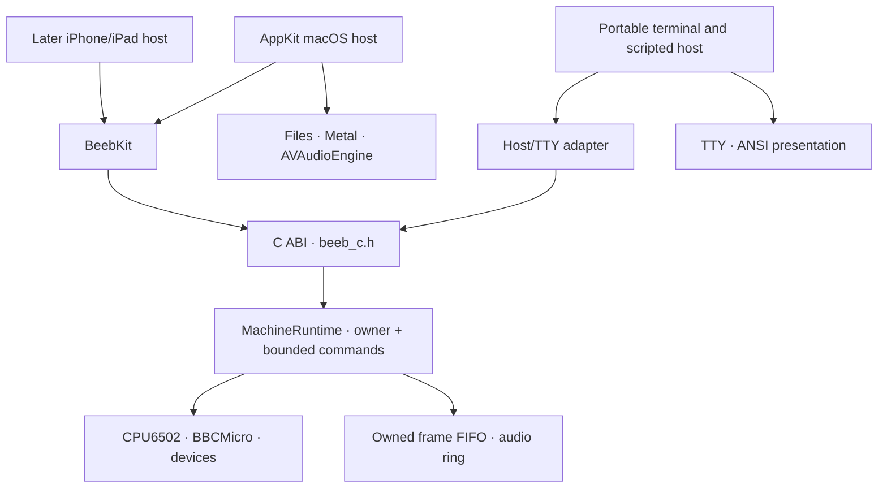

# Architecture

**Status:** Current system boundary contract
**Updated:** 2026-08-01

The [Machine delivery plan](product/MACHINE_DELIVERY_PLAN.md) selects outcomes.
This document constrains their implementation. It does not set priority or
claim completion; [STATUS.md](STATUS.md) owns verified state.

## Dependency direction

Dependencies point down only. `BeebCore` owns emulated truth. It performs no
file access, UI work, audio-device work, networking or host-clock scheduling.
Hosts supply bytes and consume owned values through the C ABI and `BeebKit`.
The portable C++ layers have no dependency on Foundation, AppKit, UIKit,
SwiftUI, Metal, Apple audio, Terminal/TTY handling or ANSI presentation.

## Current invariants

1. **One machine owner.** Supported BBC hosts use `MachineRuntime`; direct
   `BBCMicro` use is limited to single-threaded core diagnostics.
2. **One safe point.** Commands complete only after a whole instruction and its
   device ticks. No host observes a half-completed transition.
3. **Emulated time is internal.** Host refresh, audio callbacks and wall time
   consume output; they never advance the machine.
4. **Failures cross boundaries as values.** C++ exceptions stop at the C ABI.
   C and Swift preserve operation-specific status and ownership.
5. **Output is bounded and owned.** Frame/audio pressure cannot block the
   emulator or expose borrowed producer storage. Reset discards stale retained
   output as an accounted epoch boundary.
6. **Identity is explicit and separate from support.** Machine profiles are
   bounded owned values with versioned base and expansion identifiers. Model B
   is supported; Model B+ 64K is recognised but unavailable. Malformed,
   unknown, incompatible and unavailable values reject without fallback or
   partial machine mutation.
7. **User content stays external.** Firmware and media are imported bytes.
   Source media is never silently overwritten.
8. **The first host workflow stays bounded.** Model B firmware roles, fixed
   language bank 12, physical key translation, owned completed-frame dequeue,
   presentation epochs and independent controls remain host concerns over the
   existing owner; no text injection, second runtime or host-side emulation
   clock is introduced.
9. **Hosts share machine semantics.** AppKit, terminal automation and later
   mobile hosts may adapt presentation and interaction, but use the same
   runtime lifecycle, keyboard, firmware, media, output and diagnostic
   contracts. A terminal host is not a parallel console emulator.

## Maintained build boundaries

- The portable C++20 core and C ABI build through Make.
- `BeebKit` and the demo build through Swift Package Manager.
- `Beeb6502.xcodeproj` is the interactive Apple entry point and consumes the
  same local package products; it does not duplicate core or wrapper sources.
- Evidence generators and documentation tooling are build products. They never
  enter the runtime dependency graph.

## Required evolution

- Snapshot work must preserve the current quiescent safe point, use a bounded
  versioned envelope, persist the selected profile and restore
  failure-atomically.
- Bus-cycle work may refine internal execution but must retain a documented
  public quiescent boundary until a separately versioned contract replaces it.
- Model B+ work must be reference-led and keep profile-specific firmware,
  memory, controller and compatibility evidence separate from Model B. Its
  assigned identity is not evidence that any B+ behavior exists.
- Inspection and editing must use stable observations and atomic transactions;
  no UI may borrow or mutate live core state directly.

## macOS host UI direction

The maintained macOS application is AppKit-first. AppKit owns windows,
responder chains, keyboard matrix capture, menus, toolbar, settings, lifecycle
actions and accessibility. SwiftUI may be embedded selectively where it reduces
complexity without obscuring native macOS behavior; it does not own the macOS
application structure. New workflow surfaces must not introduce SwiftUI-only
focus or event workarounds. The current SwiftUI root remains a transitional
host until the AppKit migration is delivered and directly re-accepted.

The primary window contains the native toolbar, full-width CRT presentation,
running-machine footer and optional BBC keyboard drawer in that order. Settings
owns machine/hardware selection and applies live, pause-required,
restart-required and potentially destructive changes through explicit atomic
boundaries and proportional recovery interlocks. Developer inspection uses a
separate window and stable runtime snapshots.

## Terminal host direction

The terminal executable is a presentation/input adapter over the same C ABI and
`MachineRuntime` behavior. It should remain buildable on supported POSIX hosts;
TTY/ANSI code stays in the executable and never enters the core. Interactive
mode uses raw input and an alternate screen to expose only the machine display;
host commands are hidden behind an escape prefix. Scripted mode submits bounded
production commands and emits deterministic observations suitable for CPU,
ROM, device and complete-machine regression tests. Apple parity tests separately
prove that BeebKit preserves the same operations and observations.

Terminal text is derived from emulated video state rather than intercepted OS
printing, so software that writes display memory remains observable. Graphics
may be approximated for terminal presentation without changing or weakening the
owned-frame fidelity contract. Terminal teardown restores host TTY state on all
supported exit paths.

Detailed interaction requirements are in
[Desktop experience direction](product/DESKTOP_EXPERIENCE.md).

Detailed requirements for unfinished core slices are in
[IMPLEMENTATION_CONSTRAINTS.md](IMPLEMENTATION_CONSTRAINTS.md).

## Contract owners

- [Core code layers](code/architecture.md)
- [Runtime ownership](code/runtime-ownership.md)
- [Host boundary](code/host-boundary.md)
- [Timing model](code/timing-model.md)
- [Bounded output](code/bounded-output.md)
- [Evidence and testing](code/evidence-and-testing.md)
- [Code documentation standard](CODE_DOCUMENTATION.md)

Those guides own detailed rationale. Public declarations own caller contracts.
This file owns only cross-component boundaries.
