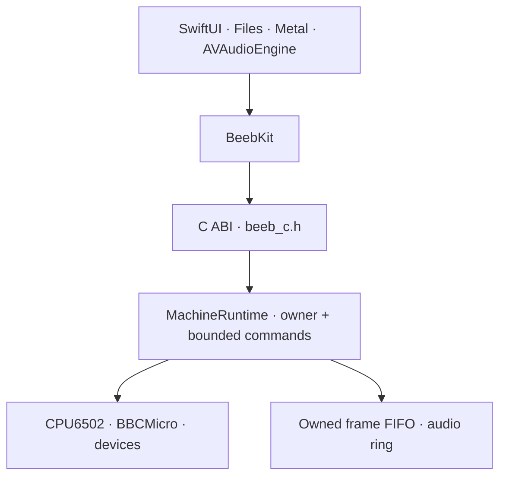

# Architecture

**Status:** Current system boundary contract
**Updated:** 2026-07-19

The [Machine delivery plan](product/MACHINE_DELIVERY_PLAN.md) selects outcomes.
This document constrains their implementation. It does not set priority or
claim completion; [STATUS.md](STATUS.md) owns verified state.

## Dependency direction

Dependencies point down only. `BeebCore` owns emulated truth. It performs no
file access, UI work, audio-device work, networking or host-clock scheduling.
Hosts supply bytes and consume owned values through the C ABI and `BeebKit`.

## Current invariants

1. **One machine owner.** Supported BBC hosts use `MachineRuntime`; direct
   `BBCMicro` use is limited to single-threaded core diagnostics.
2. **One safe point.** Commands complete only after a whole instruction and its
   device ticks. No host observes a half-completed transition.
3. **Emulated time is internal.** Host refresh, audio callbacks and wall time
   consume output; they never advance the machine.
4. **Failures cross boundaries as values.** C++ exceptions stop at the C ABI.
   C and Swift preserve operation-specific status and ownership.
5. **Output is bounded and owned.** Frame/audio pressure cannot block the
   emulator or expose borrowed producer storage. Reset discards stale retained
   output as an accounted epoch boundary.
6. **Identity is explicit.** Machine profile and expansion identifiers must be
   versioned, persisted where relevant and rejected safely when unknown.
7. **User content stays external.** Firmware and media are imported bytes.
   Source media is never silently overwritten.

## Maintained build boundaries

- The portable C++20 core and C ABI build through Make.
- `BeebKit` and the demo build through Swift Package Manager.
- `Beeb6502.xcodeproj` is the interactive Apple entry point and consumes the
  same local package products; it does not duplicate core or wrapper sources.
- Evidence generators and documentation tooling are build products. They never
  enter the runtime dependency graph.

## Required evolution

- Target-profile work must add extensible Model B and Model B+ 64K identities
  without a closed two-value design.
- Snapshot work must preserve the current quiescent safe point, use a bounded
  versioned envelope and restore failure-atomically.
- Bus-cycle work may refine internal execution but must retain a documented
  public quiescent boundary until a separately versioned contract replaces it.
- Model B+ work must be reference-led and keep profile-specific firmware,
  memory, controller and compatibility evidence separate from Model B.
- Inspection and editing must use stable observations and atomic transactions;
  no UI may borrow or mutate live core state directly.

Detailed requirements for unfinished core slices are in
[IMPLEMENTATION_CONSTRAINTS.md](IMPLEMENTATION_CONSTRAINTS.md).

## Contract owners

- [Core code layers](code/architecture.md)
- [Runtime ownership](code/runtime-ownership.md)
- [Host boundary](code/host-boundary.md)
- [Timing model](code/timing-model.md)
- [Bounded output](code/bounded-output.md)
- [Evidence and testing](code/evidence-and-testing.md)
- [Code documentation standard](CODE_DOCUMENTATION.md)

Those guides own detailed rationale. Public declarations own caller contracts.
This file owns only cross-component boundaries.
