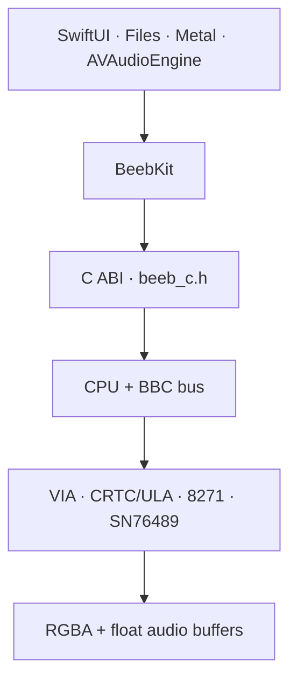

# Architecture

## Product relationship

The core is a standalone technical strand with its own
[roadmap](CORE_ROADMAP.md). It enables, but is not governed internally by, the
wider [product vision](product/VISION.md). Product requirements may request a
capability; this architecture determines how to provide it while keeping the
machine deterministic and portable. Host presentation must not become the
source of emulated machine time.

## Boundary

`BeebCore` owns deterministic emulation state. It performs no file access,
window creation, audio-device access or network access. ROM/media bytes enter
through explicit load methods. Video and audio leave as plain buffers.

The C ABI in `beeb_c.h` is the stable cross-language seam. `BeebKit` owns the
Swift lifetime and locking wrapper. `BeebDemo` owns document import and UI.

No C++ exception may cross the C ABI. Fallible entry points translate failures
into sentinel return values and retain a per-machine diagnostic for the host to
read immediately. `BeebKit` converts those diagnostics into `BeebError` values.
The Swift wrapper serializes every read and mutation of core state with one
lock, which is the basis for its `Sendable` conformance.

## Timing today

The CPU executes one complete instruction, returns its documented cycle count,
then calls `Bus::tick(cycles)`. The BBC bus advances the 1 MHz VIAs, selected
CRTC clock and 8271 from that count before the next instruction. This provides
correct long-term rates and instruction cycle totals, but hardware events can
be observed several cycles late.

The next timing architecture should express every CPU operation as bus-cycle
micro-steps:

1. drive address/RW/data for the next CPU phase;
2. perform the bus access, including slow-device stretch;
3. tick CRTC, VIAs, FDC and audio clocks;
4. sample IRQ/NMI/RDY at the correct boundary;
5. commit the micro-operation and advance.

Keep the current instruction tests as a semantic layer while adding bus-trace
tests for the new sequencer.

## Memory

- `$0000–$7FFF`: 32 KiB RAM.
- `$8000–$BFFF`: selected 16 KiB sideways bank.
- `$C000–$FBFF`, `$FF00–$FFFF`: OS ROM.
- `$FC00–$FEFF`: I/O overlay; unimplemented devices return `$FF`.

Current Model B I/O includes the CRTC, Video ULA, ROM latch, System and User
VIAs and 8271.

## Video

The CRTC supplies geometry and start addresses. The bitmap renderer expands the
BBC's interleaved bitplanes through the ULA palette. The Mode 7 renderer reads
the 1 KiB teletext window, applies line-local control state and draws a
clean-room font/mosaics.

The rendering API returns owned RGBA bytes. A Metal front end can upload this
as a texture now; a later cycle renderer can preserve the same output contract.

## Media and legal boundary

The repository contains no Acorn MOS, BASIC, DFS, game or SAA5050 character
ROM. The host chooses and supplies bytes. `.gitignore` excludes common ROM and
media extensions so a developer is less likely to commit private images by
accident.

SSD/DSD handling copies the user image into deterministic core state. Writable
media changes the in-memory copy; a future host API should explicitly export a
modified image rather than silently writing the source file.

## Version boundary

`beeb/version.h` is the compiled version source for C, C++ and Swift hosts.
`VERSION` is the release-tooling source, and `make check-version` prevents it
from drifting from the binary or changelog. Releases use Semantic Versioning;
see `docs/RELEASING.md` for the synchronization and tagging procedure.
