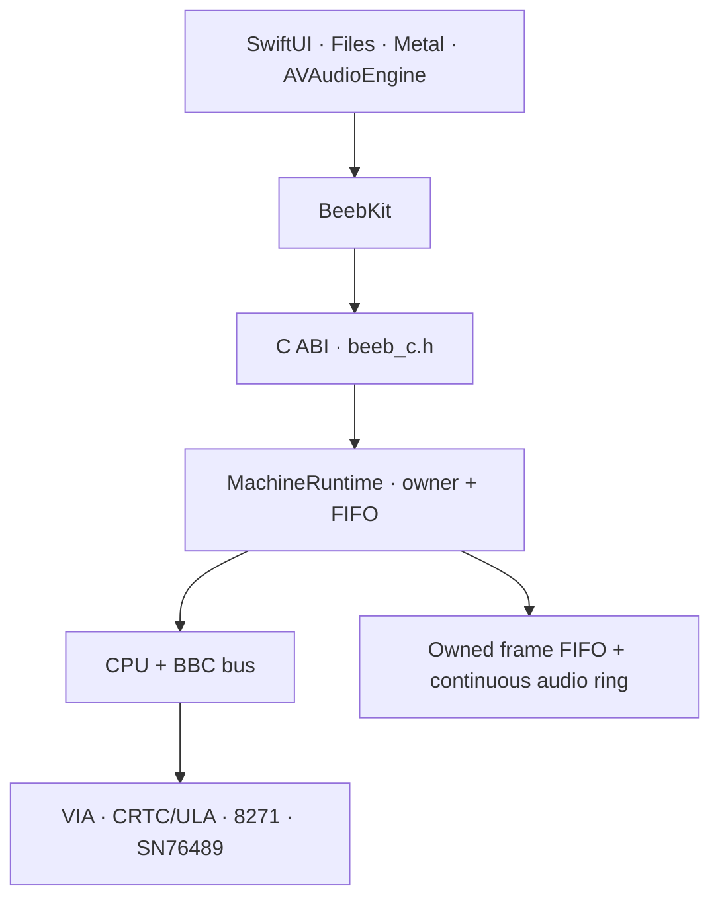

# Architecture

## Product relationship

The core is a standalone technical strand with its own
[roadmap](CORE_ROADMAP.md). It enables, but is not governed internally by, the
wider [product vision](product/VISION.md). Product requirements may request a
capability; this architecture determines how to provide it while keeping the
machine deterministic and portable. Host presentation must not become the
source of emulated machine time.

## Boundary

`BeebCore` owns deterministic emulation state. It performs no file access,
window creation, audio-device access or network access. ROM/media bytes enter
through explicit load methods. Video and audio leave as plain buffers.

The C ABI in `beeb_c.h` is the stable cross-language seam. `BeebKit` owns the
Swift lifetime and typed value/error mapping. `BeebDemo` owns document import
and UI.

`Beeb6502.xcodeproj` is the checked-in Apple development and application build
surface. Its shared macOS, iOS Simulator, and test schemes consume the same
local package products and demo source used by Swift Package Manager; the
project does not fork, copy, or become an alternative authority for `BeebCore`
or `BeebKit`. The portable Makefile and `Package.swift` remain required
independent build paths. Project settings and schemes may depend on Apple SDKs,
but that dependency stops at the host boundary.

No C++ exception may cross the C ABI. Fallible entry points return structured,
operation-owned statuses and write outputs only on success or a documented
recoverable partial result. `BeebKit` preserves each category and diagnostic as
a typed `BeebError` and returns Swift-owned values. It adds no lock because the
runtime owner already serializes concurrent calls.

Within C++, `MachineRuntime` is the supported synchronization boundary for a
machine. It constructs one `BBCMicro` on one owner thread, accepts copied
commands through a capacity-64 FIFO, and returns only operation-owned status or
result values. Direct `BBCMicro` construction remains a low-level facility only
for single-threaded core and standalone CPU diagnostics.

## Runtime ownership closure

Phase C1 makes this owner path mandatory for supported BBC hosts. The owner
arbitrates a capacity-64 FIFO with sustained execution, completes commands at
the quiescent instruction/device boundary, drains accepted work before joining,
and contains failures as structured C++/C/Swift values. Exact replay records
accepted host interleaving and emulated slices without turning the ledger into
a persistence format.

This boundary is now stable input to C3. C2 adds bounded completed-frame and
continuous-audio production behind the same owner, plus non-mutating output
diagnostics. The capacity-three frame FIFO drops the oldest frame under
pressure; the capacity-4,096 audio ring does the same for samples and reports
exact underrun demand. Outputs are owned across C++/C/Swift and publication is
driven only by committed emulated cycles. C3 may serialize architectural state
only at the same quiescent safe point. Neither phase may reintroduce direct host
access to `BBCMicro`, and C2 output is not a persisted format.

The C frame adapter preallocates an opaque release context before requesting a
destructive dequeue. Once the owner returns an owned frame, its pixel vector is
moved into that context without a second allocation or copy. This orders every
fallible adapter resource before queue mutation: resource exhaustion preserves
caller output, FIFO depth, and consumed accounting. Swift copies the resulting
view before returning the context, so the ownership chain remains runtime
result -> C release context -> Swift value with no borrowed producer storage
and no compensating requeue transaction.

Device reset also forms an output epoch boundary. The owner discards retained
pre-reset frame/audio storage, clears fractional audio timing, and restores the
latest output status without rewinding runtime-lifetime identities or counters.
The discarded depths are accounted as frame drops/audio overruns, preserving
the same conservation equations while preventing stale media from crossing the
reset boundary.

## Evidence-tool boundary

`Tools/beeb-evidence` is a headless host of the same supported C ABI used by
Swift. Named workloads supply lawful generated bytes, drive one machine, and
write explicit state or complete-frame observations under `.build/c0/`.
Approved comparisons live separately under `Tests/Fixtures/C0/`; the ordinary
verifier can read them but cannot replace them.

The evidence executable and clean-room fixture generators are build/test
products, not core components. No runtime library target imports them, calls
them, or owns an evidence file format. This keeps observation policy from
becoming emulated behavior and lets a future host reproduce the same evidence
through the public boundary.

## Generated-documentation boundary

Tracked declaration comments and focused `docs/code/` guides are authoritative.
`scripts/build-docs.sh` feeds those sources to Doxygen and, on macOS, the
official Swift-DocC command plugin. It writes one disposable site under
`.build/docs/` with a unified landing page and validates links, markup, public
coverage, changed-code rationale, and the zero-growth debt inventory.

Information has three owners:

- public contract comments beside C, C++, and Swift declarations own caller
  guarantees such as ownership, lifetime, errors, concurrency, and side effects;
- short `C0-DOC-RATIONALE` links beside non-obvious implementation code point to
  the invariant without narrating the statements;
- focused guides own cross-symbol architecture, timing, host-boundary, and
  evidence relationships.

Doxygen, DocC, the builder, and generated HTML are development tooling only.
The DocC package is a command-plugin dependency with no target product edge;
neither documentation nor evidence tooling enters `BeebCore`, `BeebKit`, or the
runtime dependency direction shown above.

## Timing today

The CPU executes one complete instruction, returns its documented cycle count,
then calls `Bus::tick(cycles)`. The BBC bus advances the 1 MHz VIAs, selected
CRTC clock and 8271 from that count before the next instruction. This provides
correct long-term rates and instruction cycle totals, but hardware events can
be observed several cycles late.

`MachineRuntime` treats the boundary after that complete instruction and all
aggregate device ticks as its quiescent safe point. Sustained execution occurs
in deterministic minimum 2,048-cycle slices, with the command FIFO checked
between slices. This ownership policy prevents host races; it does not claim
bus-cycle fidelity or make host wall time part of emulated time.

The next timing architecture should express every CPU operation as bus-cycle
micro-steps:

1. drive address/RW/data for the next CPU phase;
2. perform the bus access, including slow-device stretch;
3. tick CRTC, VIAs, FDC and audio clocks;
4. sample IRQ/NMI/RDY at the correct boundary;
5. commit the micro-operation and advance.

Keep the current instruction tests as a semantic layer while adding bus-trace
tests for the new sequencer. The sequencer must remain behind the same owner:
host commands cannot observe a half-completed bus operation, and a finer public
safe point requires a separately versioned contract and evidence rather than
an incidental consequence of the implementation rewrite.

## Memory

- `$0000–$7FFF`: 32 KiB RAM.
- `$8000–$BFFF`: selected 16 KiB sideways bank.
- `$C000–$FBFF`, `$FF00–$FFFF`: OS ROM.
- `$FC00–$FEFF`: I/O overlay; unimplemented devices return `$FF`.

Current Model B I/O includes the CRTC, Video ULA, ROM latch, System and User
VIAs and 8271.

## Video

The CRTC supplies geometry and start addresses. The bitmap renderer expands the
BBC's interleaved bitplanes through the ULA palette. The Mode 7 renderer reads
the 1 KiB teletext window, applies line-local control state and draws a
clean-room font/mosaics.

The renderer supplies machine-owned RGBA bytes. `MachineRuntime` copies each
newly completed frame into an owner-only capacity-three FIFO at the safe point;
C++ transfers an owned value, C allocates a caller-released value, and Swift
copies it into `Data`. A Metal front end can upload this now without borrowing
renderer or queue storage. A later cycle renderer can preserve the same output
contract.

## Audio and output diagnostics

Continuous output is fixed mono Float32 at 48 kHz. The runtime converts
committed 2 MHz CPU cycles using the exact `3 / 125` ratio and retains the
fractional remainder across slices. Its capacity-4,096 ring never waits for a
host: oldest samples are dropped under producer pressure, drains return exact
shortfall and demand, and all boundaries return owned or caller-buffer copies.

One serialized diagnostic command copies progress, queue capacities and
depths, demand, exact produced/consumed/dropped counters, and latest output
status without advancing the machine. Host-observed emulation rate is a pure
calculation over two snapshots and a supplied interval; host wall time never
becomes an emulated clock.

## Media and legal boundary

The repository contains no Acorn MOS, BASIC, DFS, game or SAA5050 character
ROM. The host chooses and supplies bytes. `.gitignore` excludes common ROM and
media extensions so a developer is less likely to commit private images by
accident.

SSD/DSD handling copies the user image into deterministic core state. Writable
media changes the in-memory copy; a future host API should explicitly export a
modified image rather than silently writing the source file.

## Version boundary

`beeb/version.h` is the compiled version source for C, C++ and Swift hosts.
`VERSION` is the release-tooling source, and `make check-version` prevents it
from drifting from the binary or changelog. Releases use Semantic Versioning;
see `docs/RELEASING.md` for the synchronization and tagging procedure.
