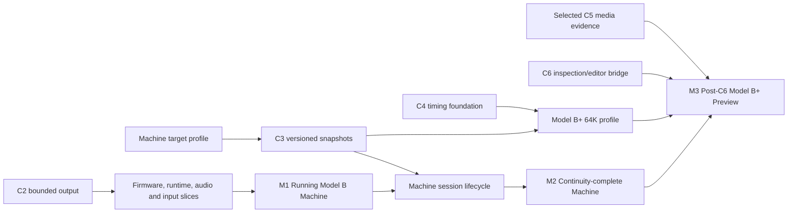

# Machine application delivery plan

**Status:** Canonical cross-strand planning document
**Updated:** 2026-07-17

This plan turns the emulator foundation into a working native application while
keeping product outcomes, portable core behavior and Apple host integration in
their proper strands. It is a programme map, not an umbrella feature
specification. Every named slice enters the repository through its own bounded
Spec Kit specification, plan, tasks, analysis and verified implementation.

The historical [product requirements document](../Archive/PRD.md) supplies
useful intent: an authentic Machine, dependable Media, a modern BBC BASIC
Editor, inspection, accessible Apple-platform UX and a primary journey in which
a user types and runs a program. Its milestone ordering, implementation
assumptions and unvalidated numeric targets are not current requirements; the
[legacy decision register](LEGACY_DECISIONS.md) records their disposition.

## Target profiles

Delivery uses explicit machine profiles so compatibility and persisted state
cannot silently change meaning:

- **Model B:** the implemented and verified first profile. It is the shortest
  path to the first working Machine application and remains a permanent
  regression profile.
- **Model B+ 64K:** the planned post-C6 application profile. Its exact processor,
  memory, display, firmware and disc-controller behavior must be fixed from
  primary references and compatibility fixtures before implementation claims.
- **Model B+ 128K:** outside the committed application gate until a separate
  product case and machine-profile specification approve it.

The application must display the selected profile and reject firmware,
snapshots or media that are incompatible with it. No profile may be inferred
only from file names or host UI state.

## Platform scope

M1 is a maintained macOS user workflow; the shared iOS Simulator build remains
green but is not mistaken for a complete touch-input experience. Adaptive
iPhone/iPad keyboard and layout work enters through a separate Horizon 1 product
slice before those platforms claim M1. M2 adds platform-appropriate lifecycle
evidence, including iOS/iPadOS background and restoration behavior. M3 reruns
the maintained host workflows selected by its feature specification; external
beta and App Store device coverage remain Horizon 4 gates.

## Delivery gates

### M1 — Running Model B Machine

**Depends on:** Integrated C1 and C2; the Horizon 1 host slices below.

M1 is the first working application and must not wait for C5 or C6. It passes
only when a user can:

1. import user-owned OS and BASIC ROMs through the application;
2. boot to a BASIC-ready state without shell commands;
3. type and run a documented short BASIC program through host keyboard mapping;
4. see continuous video consumed from C2 completed-frame output;
5. hear continuous audio consumed from C2 bounded audio output; and
6. use distinct run, pause, reset and BREAK controls while diagnostics expose
   emulation rate, frame pressure or age, and audio pressure.

The maintained acceptance run must prove that the main actor remains responsive,
host refresh and audio callbacks never drive emulated time, failures recover to
an actionable state, and no proprietary ROM bytes enter the repository.

### M2 — Continuity-complete Machine

**Depends on:** M1 and completed C3 snapshot contracts.

M2 passes when backgrounding and restoration preserve the selected profile,
CPU, RAM, ROM selection, devices and mounted-media state; stale frame/audio
output is not presented after restore; corrupt, oversized or incompatible state
is rejected without partially mutating the active session.

### M3 — Post-C6 Model B+ Developer Preview

**Depends on:** M2, the Model B+ 64K profile workstream, completed C6 bridge
contracts, and the selected compatibility/media evidence named by its feature
specifications.

M3 is the requested post-C6 outcome. It passes only when:

- the Model B regression profile still passes M2;
- a user selects Model B+ 64K, imports compatible user-owned firmware, boots to
  BASIC, types and runs the M1 program, and receives continuous video and audio;
- a Model B+ snapshot round-trip preserves the profile and continues
  deterministically;
- one curated timing-sensitive case demonstrates progress from C4;
- one safe mount, protection and explicit-export workflow demonstrates progress
  from C5 on a named supported profile, while any B+ controller limitation is
  reported separately; and
- the completed C6 contracts are exercised through a read-only inspector,
  bounded breakpoint/watchpoint control, a validated atomic memory transaction,
  and a BASIC program-boundary round trip, without racing execution or losing
  data.

M3 is a limited Developer Preview, not a claim of preservation-grade or
complete BBC emulation. The application must expose its version, active profile,
runtime health and a route to the current `STATUS.md` fidelity catalogue.

## Specification sequence

Feature numbers are assigned only when a slice is selected. Names below are
stable planning identities, not permission to combine them into one sprint.

| Order | Specification | Strand | Depends on | Independently demonstrable outcome |
| --- | --- | --- | --- | --- |
| 1 | `machine-target-profile` | Cross-strand | C2 | Model B identity is explicit across core, C, Swift and host configuration; Model B+ 64K requirements and non-goals are ratified. |
| 2 | `machine-firmware-onboarding` | Product/cross-strand | Target profile | The app imports, validates, assigns and locally remembers user-owned OS and sideways ROM access without bundling content. |
| 3 | `machine-runtime-presentation` | Cross-strand | C1, C2 | The host uses sustained runtime ownership and C2 frame dequeue without main-actor emulation or host-driven machine time. |
| 4 | `machine-audio-output` | Cross-strand | C2 | AVAudioEngine consumes bounded audio with measured latency/pressure and recoverable device lifecycle behavior. |
| 5 | `machine-keyboard-controls` | Product/cross-strand | Runtime presentation | Physical input, BBC mapping, key help, capture, full screen, run, pause, reset and BREAK are distinct and accessible. |
| 6 | `machine-mvp-validation` | Cross-strand | Slices 2–5 | The automated/manual evidence bundle proves M1 from firmware import through BASIC execution and sustained output. |
| 7 | `snapshot-format-v1` | Core C3 | C1 safe point, target profile | A bounded, versioned envelope records machine-profile identity and architectural state rules. |
| 8 | `snapshot-round-trip` | Core C3 | Snapshot format | CPU, RAM, ROM selection and devices continue deterministically after restore. |
| 9 | `snapshot-mounted-media` | Core C3 | Snapshot format | Mounted-media identity and modified private state restore or reject explicitly. |
| 10 | `snapshot-host-boundary` | Core C3 | C3 state slices | C and Swift callers save/load with owned data and recoverable failures. |
| 11 | `machine-session-lifecycle` | Cross-strand | M1, C3 | Background, termination and restoration satisfy M2 without stale host output. |
| 12 | C4 bus-cycle sequence | Core | C3 invariant | Reference-backed traces and compatibility fixtures improve timing without breaking M2. |
| 13 | Model B+ 64K profile sequence | Core/cross-strand | Target profile, C3, relevant C4 foundation | Profile selection, processor, memory/display, firmware boot and selected storage behavior satisfy the B+ portions of M3. |
| 14 | `machine-disk-workflow` / `machine-tape-file-workflow` | Product/cross-strand | Selected C5 slices | User-owned media can be mounted, diagnosed and exported without silent source mutation. |
| 15 | `machine-inspector` | Product/cross-strand | C6 inspection contracts | Read-only CPU, memory and device inspection demonstrates C6 safely. |
| 16 | BASIC transformation and editing slices | Product | C6 transaction/program boundaries | Tokenization, labels, inject/retrieve and conflict handling progress toward the full Editor vision. |

## Dependency view

## Evidence and scope rules

- Product tests prove user journeys; core tests prove deterministic machine
  behavior; cross-strand tests prove the boundary between them.
- Each timing, compatibility, latency or frame-pacing claim defines its fixture,
  host/toolchain, observation interval and tolerance in the selected feature
  specification. Archived targets such as fixed `±0.1 FPS` or `<10 ms` audio
  latency are hypotheses until current research justifies them.
- Proprietary firmware and user media remain outside the repository. Automated
  evidence uses lawful fixtures; optional private compatibility runs may record
  hashes and results without copying the inputs.
- Accessibility is part of every user-facing slice, including keyboard-only
  operation, VoiceOver, focus recovery, Dynamic Type where applicable, and a
  discoverable full-screen exit.
- `docs/STATUS.md` remains the authority for verified hardware fidelity. This
  plan and the application may expose progress, but neither may convert planned
  behavior into a completion claim.
